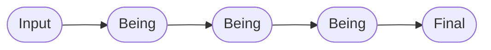
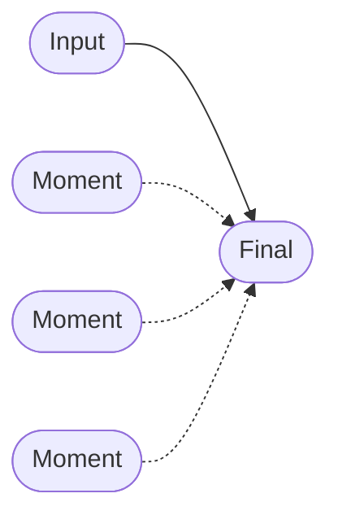
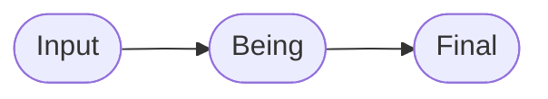
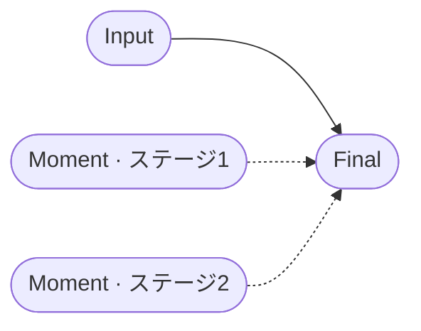
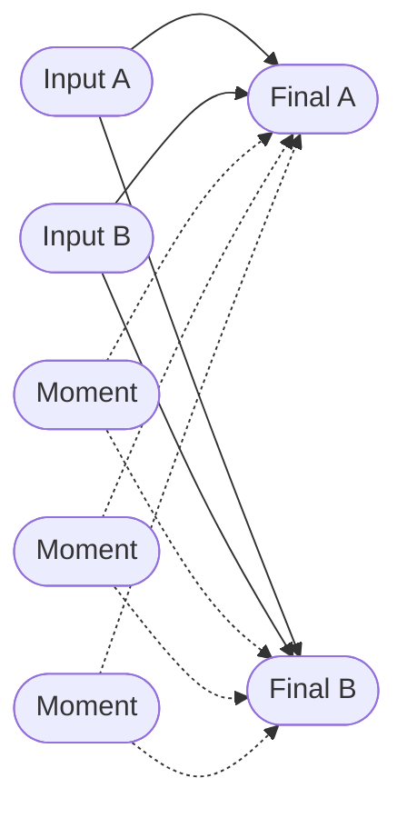

# Be Framework パターン集

[Be Framework](https://github.com/be-framework/be) のための**変容（メタモルフォーシス）パターンカタログ**です。8つの実行可能なPHPデモを収録し、それぞれが1つのフロー形状を独立して示しているため、自分のアプリケーションの出発点としてそのままコピーできます。

> **「Be, Don't Do（するな、あれ）」** — すべてのパターンは、ワークフローを「データに対して動作するメソッド」ではなく、「次の状態へと *becoming* する型付き・不変な状態の連鎖」としてモデル化します。

---

## パターンを選ぶ

あなたの問題に最も近い行を選んでください。各リンクから完全な実装（テスト付き）に飛べます。

| こんな問題には… | パターン | デモ |
|---|---|---|
| 入力1、出力1、中間状態なし | **最小変換** | [hello-world](./demos/hello-world/) |
| 単一フォームの検証と正規化 | **線形** | [contact-form](./demos/contact-form/) |
| 順序のある複数の変換 | **連鎖チェーン** | [user-registration](./demos/user-registration/) |
| 独立した関心事が注入Momentを通じてFinalで収束 | **ダイヤモンド** | [order-processing](./demos/order-processing/) |
| 1つのBeingが複数Reasonサービスをオーケストレーション | **マルチReason Being** | [blog-publishing](./demos/blog-publishing/) |
| 1入力から判定で複数結果に分岐 | **分岐** | [medical-triage](./demos/medical-triage/) |
| 段階的なMoment実現（ステージ1がステージ2のゲート） | **カスケードダイヤモンド** | [loan-application](./demos/loan-application/) |
| 複数入力が複数Finalに分岐し、Momentを共有 | **複合収束** | [insurance-claim](./demos/insurance-claim/) |

> このカタログの機械可読版は [`docs/patterns.json`](./docs/patterns.json) にあります。
>
> **図の凡例**: 実線矢印（`→`）は `#[Be]` による変換チェーン。破線矢印（`⇢`）は `#[Inject]` で Final に注入される Moment を表し、各 Moment は Final のコンストラクタ内で自己完結（`be()`）します。

---

## パターンカタログ

### 最小変換 — [hello-world](./demos/hello-world/)

**フロー:** `Input → Final`


最もシンプルなBe Frameworkデモ。BeingやMomentレイヤーを持たない挨拶変換です。

> 具体: `HelloInput → Hello`

### 線形 — [contact-form](./demos/contact-form/)

**フロー:** `Input → Being → Final`


基本的な入力検証、メール正規化、受領証生成を示すお問い合わせフォームです。

> 具体: `ContactInput → EmailNormalized → ContactReceived`

### 連鎖チェーン — [user-registration](./demos/user-registration/)

**フロー:** `Input → Being(A) → Being(B) → Being(C) → Final`



Being変換を連鎖させたユーザー登録：メール検証、パスワードハッシュ化、プロフィール拡充。

> 具体: `RegistrationInput → EmailVerified → PasswordHashed → ProfileEnriched → UserRegistered`

### ダイヤモンド — [order-processing](./demos/order-processing/)

**フロー:** `Input → Final`（3つのMomentがFinalに注入される）



ECオーダー処理。`OrderInput` は直接 `OrderConfirmed` に遷移し、`OrderConfirmed` が3つの独立した Moment（`InventoryReserved`、`PaymentCompleted`、`ShippingArranged`）を `#[Inject]` します。各 Moment の `be()` は `OrderConfirmed` のコンストラクタ内で呼び出され、3つの関心事が1点で自己完結する「ダイヤモンドメタモルフォーシス」を形成します。

> 具体: `OrderInput → OrderConfirmed`（Final に `InventoryReserved`・`PaymentCompleted`・`ShippingArranged` を注入）

### マルチReason Being — [blog-publishing](./demos/blog-publishing/)

**フロー:** `Input → Being → Final`



記事公開デモ。外形的には Linear と同じ `ArticleInput → ArticlePrepared → ArticlePublished` です。特徴は中間 Being（`ArticlePrepared`）が複数の Reason サービス（`MarkdownRenderer`、`SlugGenerator`、`ExcerptExtractor`、`AuthorResolver`）をオーケストレーションし、マークダウンレンダリング・スラグ生成・抜粋抽出・著者解決を1つの変換の中でまとめて行う点にあります。

> 具体: `ArticleInput → ArticlePrepared → ArticlePublished`

### 分岐 — [medical-triage](./demos/medical-triage/)

**フロー:** `Input → Being → [分岐] → Final(A) | Final(B) | Final(C)`


JTASプロトコルを実装した救急トリアージ。1つの入力が型付き`$being`識別子を通じて3つの異なるFinalに分岐し、各分岐の振る舞いはReason戦略クラスが保持します。

> 具体:
> ```text
> PatientInput → TriageLevelDetermined
>                       │
>        ┌──────────────┼──────────────┐
>        ↓              ↓              ↓
>   [ImmediateCase] [UrgentCase] [NonUrgentCase]
>        ↓              ↓              ↓
> EmergencyAdmitted  UrgentQueued  OutpatientReferred
> ```

### カスケードダイヤモンド — [loan-application](./demos/loan-application/)

**フロー:** `Input → Final`（2つのMomentがFinalに注入され、段階的に実現される）



住宅ローン申請デモ。`LoanInput` は直接 `LoanApproved` に遷移し、`LoanApproved` が `CollateralValued` と `InsurancePrepared` を注入します。「カスケード」は Moment 内部の Potential にあり、ステージ1の関心事（身元確認・信用・所得）がステージ2の関心事（物件評価・保険）より先に実現されなければならない点を指します。両ステージは1つの Final に収束します。

> 具体: `LoanInput → LoanApproved`（Final に `CollateralValued`・`InsurancePrepared` を注入）

### 複合収束 — [insurance-claim](./demos/insurance-claim/)

**フロー:** 2つの Input が、共有 Moment を注入された 2つの Final のいずれかに分岐する



保険請求処理デモ。`ClaimInput` と `PolicyInput` はどちらも `#[Be([ClaimSettled, ClaimEscalated])]` を宣言しており、`$being` の型マッチングによって各 Input がちょうど1つの Final に解決されます。`DamageValued`、`AdjustmentReviewed`、`FraudCleared` などの Moment は両方の Final に注入されるため、どちらの分岐を辿っても同じ自己完結ロジックが共有されます。

> 具体: `ClaimInput` + `PolicyInput` → `ClaimSettled` または `ClaimEscalated`（各 Final に共有 Moment を注入）

---

## Been — 存在証明

一部のデモでは `Been` を実装しています。`Been`はFinalオブジェクトが「なぜ今の状態にあるか」を証明する不変キャリアです。Finalは`#[Inject]`で`Been`を受け取り、`with()`でドメインイベントを記録し、`assert`で自らの因果を検証できます — 証明をテストコードからプロダクションコードへ移動させます。

| デモ | 証明する内容 |
|---|---|
| [contact-form](./demos/contact-form/) | レシートが正規化されたメールに対して生成された |
| [user-registration](./demos/user-registration/) | ユーザーが入力メールで作成された（assert） |
| [order-processing](./demos/order-processing/) | 全Momentがconfirmedステータスで完了した（assert） |

概念の詳細は Be Framework ドキュメントの[意味的ログ](https://be-framework.github.io/manuals/1.0/ja/10-semantic-logging.html)を参照してください。

---

## テスト実行

```bash
# 特定デモのテスト実行
cd demos/hello-world && composer install && vendor/bin/phpunit
```

各デモには正常系統合テスト、Semantic検証単体テスト、Reasonレイヤーロジックテスト、そして該当する場合はPotential冪等性テストが含まれます。

## 要件

- PHP 8.2+
- [Ray.Di](https://ray-di.github.io/)（依存性注入）

## 背景

上記のすべてのパターンは、同じ6つのレイヤーからなる語彙で構築されています。パターンをコピーして使うだけならこの語彙を理解する必要は**ありません**。さらに深く学びたい場合は以下から：

- [`CLAUDE.md`](./CLAUDE.md) — 不変条件と読み順（AIアシスタント向けの契約でもあります）
- [`docs/GLOSSARY.md`](./docs/GLOSSARY.md) — 用語→ファイル逆引きインデックス
- [`demos/order-processing/docs/PHILOSOPHY.md`](./demos/order-processing/docs/PHILOSOPHY.md) — 概念的な理論的背景

| レイヤー | 語源 | 役割 |
|---|---|---|
| **Input** | δύναμις（デュナミス） | システムに入る生の可能態 |
| **Being** | Dasein（現存在） | 計算されたプロパティを持つ存在状態 |
| **Moment** | 契機 | 遅延Potentialを持つ過渡的段階 |
| **Final** | ἐνέργεια（エネルゲイア） | 完全に現実化された結果 |
| **Semantic** | Sinn（意味） | ドメイン検証ルール |
| **Reason** | 充足理由律 | ビジネスロジックと外部連携 |

## ライセンス

MIT

---

[English version](./README.md)
