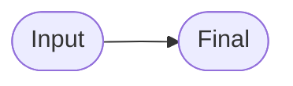
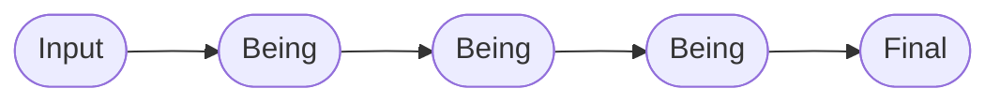
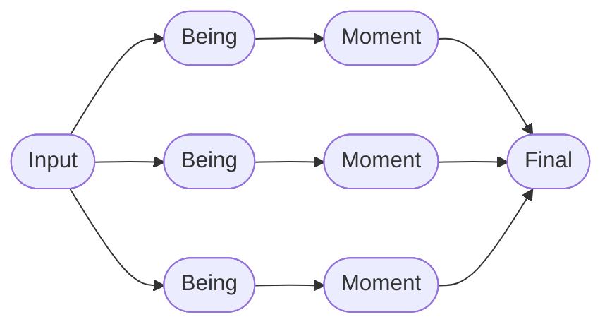
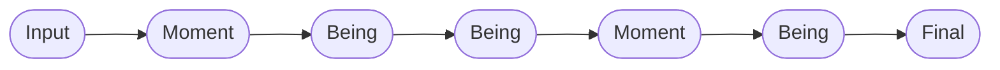
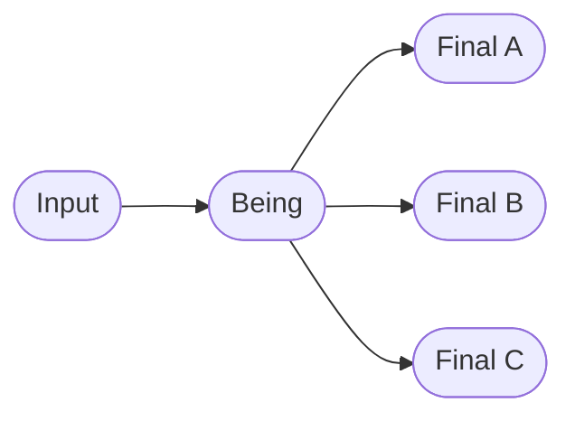
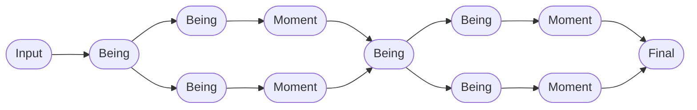
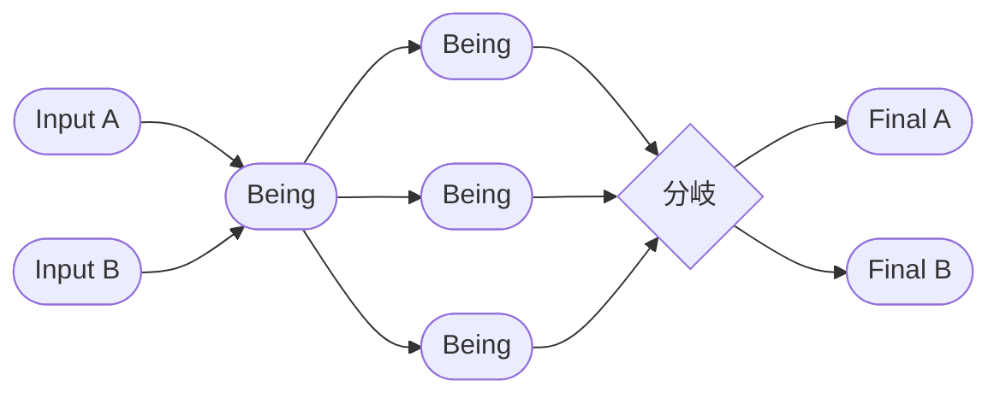

# Be Framework パターン集

[Be Framework](https://github.com/be-framework/be) のための**変容（メタモルフォーシス）パターンカタログ**です。8つの実行可能なPHPデモを収録し、それぞれが1つのフロー形状を独立して示しているため、自分のアプリケーションの出発点としてそのままコピーできます。

> **「Be, Don't Do（するな、あれ）」** — すべてのパターンは、ワークフローを「データに対して動作するメソッド」ではなく、「次の状態へと *becoming* する型付き・不変な状態の連鎖」としてモデル化します。

---

## パターンを選ぶ

あなたの問題に最も近い行を選んでください。各リンクから完全な実装（テスト付き）に飛べます。

| こんな問題には… | パターン | デモ |
|---|---|---|
| 入力1、出力1、中間状態なし | **最小変換** | [hello-world](./demos/hello-world/) |
| 単一フォームの検証と正規化 | **線形** | [contact-form](./demos/contact-form/) |
| 順序のある複数の変換 | **連鎖チェーン** | [user-registration](./demos/user-registration/) |
| 独立した関心事を並列処理して収束 | **ダイヤモンド** | [order-processing](./demos/order-processing/) |
| 段階的な中間コミットを伴う連鎖 | **連鎖 + Moment** | [blog-publishing](./demos/blog-publishing/) |
| 1入力から判定で複数結果に分岐 | **分岐** | [medical-triage](./demos/medical-triage/) |
| 直列2段、各段に独自の並列性 | **カスケードダイヤモンド** | [loan-application](./demos/loan-application/) |
| 複数入力が収束→並列→分岐 | **複合収束** | [insurance-claim](./demos/insurance-claim/) |

> このカタログの機械可読版は [`docs/patterns.json`](./docs/patterns.json) にあります。

---

## パターンカタログ

### 最小変換 — [hello-world](./demos/hello-world/)

**フロー:** `Input → Final`



最もシンプルなBe Frameworkデモ。BeingやMomentレイヤーを持たない挨拶変換です。

> 具体: `HelloInput → Hello`

### 線形 — [contact-form](./demos/contact-form/)

**フロー:** `Input → Being → Final`


基本的な入力検証、メール正規化、受領証生成を示すお問い合わせフォームです。

> 具体: `ContactInput → EmailNormalized → ContactReceived`

### 連鎖チェーン — [user-registration](./demos/user-registration/)

**フロー:** `Input → Being(A) → Being(B) → Being(C) → Final`



Being変換を連鎖させたユーザー登録：メール検証、パスワードハッシュ化、プロフィール拡充。

> 具体: `RegistrationInput → EmailVerified → PasswordHashed → ProfileEnriched → UserRegistered`

### ダイヤモンド — [order-processing](./demos/order-processing/)

**フロー:** `Input → [並列Beings] → [並列Moments] → Final`



並列Beingチェーン（在庫、決済、配送）がMomentを生成し、Final状態で収束するECオーダー処理。

> 具体:
> ```text
> OrderInput ─┬→ StockLocated → QuantityChecked   → InventoryReserved ─┬→ OrderConfirmed
>             ├→ CardValidated → PaymentAuthorized → PaymentCompleted  ─┤
>             └→ AddressValidated → CarrierSelected → ShippingArranged ─┘
> ```

### 連鎖 + Moment — [blog-publishing](./demos/blog-publishing/)

**フロー:** `Input → Moment → Being → Being → Moment → Being → Final`



3つのBeingクラス（`ArticlePrepared`、`MarkdownRendered`、`SlugGenerated`）と2つのMomentクラス（`ContentPrepared`、`MetadataResolved`）を通じて、マークダウンレンダリング、スラグ生成、抜粋抽出、著者解決を段階的に処理する記事公開デモ。

> 具体: `ArticleInput → ContentPrepared → ArticlePrepared → MarkdownRendered → MetadataResolved → SlugGenerated → ArticlePublished`

### 分岐 — [medical-triage](./demos/medical-triage/)

**フロー:** `Input → Being → [分岐] → Final(A) | Final(B) | Final(C)`



JTASプロトコルを実装した救急トリアージ。1つの入力が型付き`$being`識別子を通じて3つの異なるFinalに分岐し、各分岐の振る舞いはReason戦略クラスが保持します。

> 具体:
> ```text
> PatientInput → TriageLevelDetermined
>                       │
>        ┌──────────────┼──────────────┐
>        ↓              ↓              ↓
>   [ImmediateCase] [UrgentCase] [NonUrgentCase]
>        ↓              ↓              ↓
> EmergencyAdmitted  UrgentQueued  OutpatientReferred
> ```

### カスケードダイヤモンド — [loan-application](./demos/loan-application/)

**フロー:** `Input → Stage1(並列 → 収束) → Stage2(並列 → Final)`



段階的Moment実現を伴う住宅ローン申請。Stage 1のMomentは適格性確認時に実現、Stage 2のMomentは最終承認時に実現。

> 具体:
> ```text
> LoanInput → IdentityVerified ─┬→ CreditScored   → CreditApproved   ─┬→ EligibilityConfirmed
>                               └→ IncomeAssessed → IncomeApproved   ─┘
>                                                                      ↓
>                               ┌→ PropertyAppraised → CollateralValued ─┬→ LoanApproved
>                               └→ InsuranceQuoted   → InsurancePrepared ─┘
> ```

### 複合収束 — [insurance-claim](./demos/insurance-claim/)

**フロー:** `Input(A) + Input(B) → 収束 → 並列(3) → 分岐 → Final(A) | Final(B)`



複数入力の収束、3方向並列評価、分岐Finalを持つ保険請求処理。

> 具体:
> ```text
> ClaimInput ──┬→ ClaimRegistered ─┬→ ClaimValidated ─┬→ DamageAssessed  ─┬→ [閾値判定] → ClaimSettled
> PolicyInput ─┴→ PolicyVerified  ─┘                  ├→ AdjusterAssigned ─┤               または
>                                                     └→ FraudScreened   ─┘               ClaimEscalated
> ```

---

## テスト実行

```bash
# 特定デモのテスト実行
cd demos/hello-world && composer install && vendor/bin/phpunit
```

各デモには正常系統合テスト、Semantic検証単体テスト、Reasonレイヤーロジックテスト、そして該当する場合はPotential冪等性テストが含まれます。

## 要件

- PHP 8.2+
- [Ray.Di](https://ray-di.github.io/)（依存性注入）

## 背景

上記のすべてのパターンは、同じ6つのレイヤーからなる語彙で構築されています。パターンをコピーして使うだけならこの語彙を理解する必要は**ありません**。さらに深く学びたい場合は以下から：

- [`CLAUDE.md`](./CLAUDE.md) — 不変条件と読み順（AIアシスタント向けの契約でもあります）
- [`docs/GLOSSARY.md`](./docs/GLOSSARY.md) — 用語→ファイル逆引きインデックス
- [`demos/order-processing/docs/PHILOSOPHY.md`](./demos/order-processing/docs/PHILOSOPHY.md) — 概念的な理論的背景

| レイヤー | 語源 | 役割 |
|---|---|---|
| **Input** | δύναμις（デュナミス） | システムに入る生の可能態 |
| **Being** | Dasein（現存在） | 計算されたプロパティを持つ存在状態 |
| **Moment** | 契機 | 遅延Potentialを持つ過渡的段階 |
| **Final** | ἐνέργεια（エネルゲイア） | 完全に現実化された結果 |
| **Semantic** | Sinn（意味） | ドメイン検証ルール |
| **Reason** | 充足理由律 | ビジネスロジックと外部連携 |

## ライセンス

MIT

---

[English version](./README.md)
