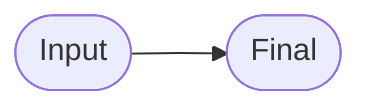
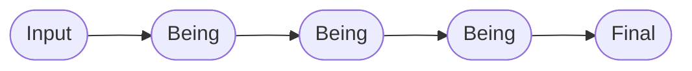
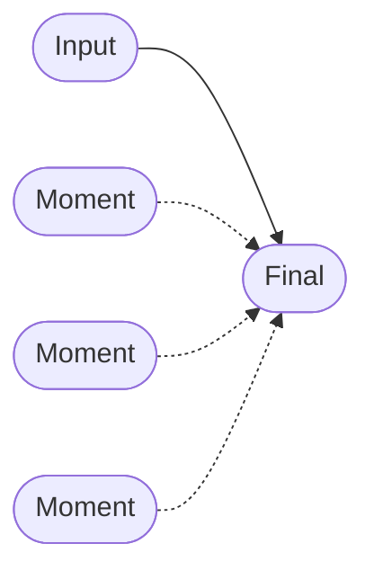
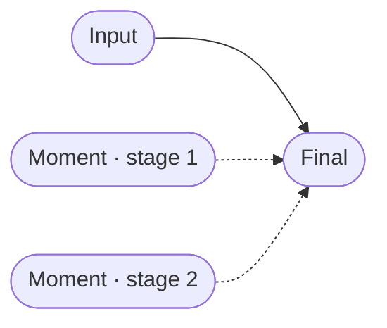
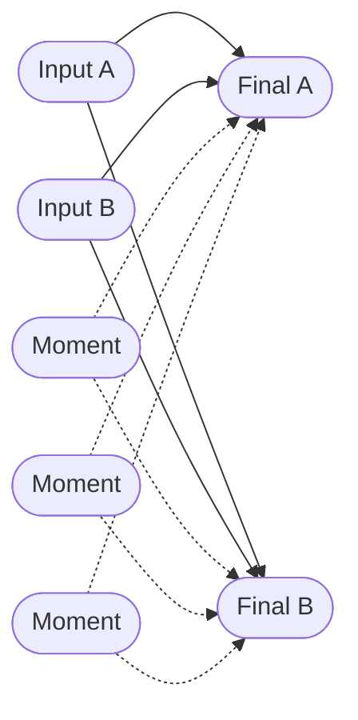

# Be Framework Patterns

A catalog of **metamorphosis patterns** for the [Be Framework](https://github.com/be-framework/be) — eight runnable PHP demos, each isolating one flow shape so you can copy it as a starting point for your own application.

> **"Be, Don't Do."** Every pattern models a workflow as a chain of typed, immutable *states that become the next state*, rather than methods that act on data.

---

## Choose a pattern

Pick the row that best describes your problem. Each link goes to a complete, tested implementation.

| If your problem looks like… | Pattern | Demo |
|---|---|---|
| One input, one output — no intermediate state | **Minimal** | [hello-world](./demos/hello-world/) |
| Validate and normalize a single form | **Linear** | [contact-form](./demos/contact-form/) |
| Several transformations that must run in order | **Sequential Chain** | [user-registration](./demos/user-registration/) |
| Independent concerns converge in a Final via injected Moments | **Diamond** | [order-processing](./demos/order-processing/) |
| One Being orchestrating multiple Reason services | **Multi-Reason Being** | [blog-publishing](./demos/blog-publishing/) |
| One input, several outcomes chosen by a decision | **Branching** | [medical-triage](./demos/medical-triage/) |
| Staged Moment realization (stage 1 gates stage 2) | **Cascade Diamond** | [loan-application](./demos/loan-application/) |
| Multiple inputs branch to multiple Finals with shared Moments | **Complex Convergence** | [insurance-claim](./demos/insurance-claim/) |

> A machine-readable version of this catalog lives in [`docs/patterns.json`](./docs/patterns.json).
>
> **Diagram legend.** Solid arrows (`→`) show the `#[Be]` transformation chain. Dashed arrows (`⇢`) show Moments injected into a Final via `#[Inject]`, where each Moment self-completes inside the Final constructor.

---

## Pattern catalog

### Minimal — [hello-world](./demos/hello-world/)

**Flow:** `Input → Final`



The simplest possible Be Framework demo. A greeting transformation with no Being or Moment layers.

> Concrete: `HelloInput → Hello`

### Linear — [contact-form](./demos/contact-form/)

**Flow:** `Input → Being → Final`


A contact form demonstrating basic input validation, email normalization, and receipt generation.

> Concrete: `ContactInput → EmailNormalized → ContactReceived`

### Sequential Chain — [user-registration](./demos/user-registration/)

**Flow:** `Input → Being(A) → Being(B) → Being(C) → Final`



User registration with chained Being transformations: email verification, password hashing, and profile enrichment.

> Concrete: `RegistrationInput → EmailVerified → PasswordHashed → ProfileEnriched → UserRegistered`

### Diamond — [order-processing](./demos/order-processing/)

**Flow:** `Input → Final` with three Moments injected into the Final



E-commerce order processing. `OrderInput` transitions directly to `OrderConfirmed`, which injects three independent Moments — `InventoryReserved`, `PaymentCompleted`, `ShippingArranged`. Each Moment's `be()` is called inside the `OrderConfirmed` constructor, so the three concerns converge ("diamond metamorphosis") at a single point of self-completion.

> Concrete: `OrderInput → OrderConfirmed` with `InventoryReserved`, `PaymentCompleted`, `ShippingArranged` injected into the Final.

### Multi-Reason Being — [blog-publishing](./demos/blog-publishing/)

**Flow:** `Input → Being → Final`


Article publishing. Externally the shape is Linear — `ArticleInput → ArticlePrepared → ArticlePublished`. What makes it distinctive is the intermediate Being (`ArticlePrepared`), which orchestrates several injected Reason services (`MarkdownRenderer`, `SlugGenerator`, `ExcerptExtractor`, `AuthorResolver`) to carry out markdown rendering, slug generation, excerpt extraction and author resolution in a single transformation.

> Concrete: `ArticleInput → ArticlePrepared → ArticlePublished`

### Branching — [medical-triage](./demos/medical-triage/)

**Flow:** `Input → Being → [Branch] → Final(A) | Final(B) | Final(C)`


Emergency room triage implementing the JTAS protocol. One input branches to three possible Finals via a typed `$being` discriminator, with each branch's behavior carried by a Reason strategy class.

> Concrete:
> ```text
> PatientInput → TriageLevelDetermined
>                       │
>        ┌──────────────┼──────────────┐
>        ↓              ↓              ↓
>   [ImmediateCase] [UrgentCase] [NonUrgentCase]
>        ↓              ↓              ↓
> EmergencyAdmitted  UrgentQueued  OutpatientReferred
> ```

### Cascade Diamond — [loan-application](./demos/loan-application/)

**Flow:** `Input → Final` with two Moments injected, realized in staged order



Mortgage application. `LoanInput` transitions directly to `LoanApproved`, which injects `CollateralValued` and `InsurancePrepared`. The "cascade" is in the Moments' internal Potentials: stage 1 concerns (identity, credit, income) must realize before stage 2 concerns (appraisal, insurance) can commit, even though both stages converge in a single Final.

> Concrete: `LoanInput → LoanApproved` with `CollateralValued`, `InsurancePrepared` injected into the Final.

### Complex Convergence — [insurance-claim](./demos/insurance-claim/)

**Flow:** Two Inputs, each branching to one of two Finals, with Moments shared across branches



Insurance claim processing. `ClaimInput` and `PolicyInput` both declare `#[Be([ClaimSettled, ClaimEscalated])]`, so each Input resolves to exactly one of the two Finals by `$being` type matching. Moments such as `DamageValued`, `AdjustmentReviewed` and `FraudCleared` are injected into both Finals, so the same self-completion logic is shared regardless of which branch is taken.

> Concrete: `ClaimInput` + `PolicyInput` → `ClaimSettled` | `ClaimEscalated`, with shared Moments injected into each Final.

---

## Been — Proof of Existence

Some demos demonstrate `Been`, an immutable carrier that a Final object uses to prove why it is what it is. The Final injects `Been` via `#[Inject]`, records domain events with `with()`, and can assert its own causal chain — moving proof from test code into production code.

| Demo | What is proved |
|---|---|
| [contact-form](./demos/contact-form/) | Receipt was generated for the normalized email |
| [user-registration](./demos/user-registration/) | User was created with the input email (assert) |
| [order-processing](./demos/order-processing/) | All moments completed with confirmed status (assert) |

See [Semantic Logging](https://be-framework.github.io/manuals/1.0/en/10-semantic-logging.html) in the Be Framework documentation for the full concept.

---

## Running tests

```bash
# Run a specific demo
cd demos/hello-world && composer install && vendor/bin/phpunit
```

Every demo ships with happy-path integration tests, Semantic validation unit tests, Reason layer logic tests, and (where applicable) Potential idempotency tests.

## Requirements

- PHP 8.2+
- [Ray.Di](https://ray-di.github.io/) (dependency injection)

## Background

Every pattern above is built from the same six-layer vocabulary. You do **not** need to understand the vocabulary to copy a pattern — but when you want to go deeper, start here:

- [`CLAUDE.md`](./CLAUDE.md) — invariants and reading order (also the AI assistant contract)
- [`docs/GLOSSARY.md`](./docs/GLOSSARY.md) — term-to-file reverse index
- [`demos/order-processing/docs/PHILOSOPHY.md`](./demos/order-processing/docs/PHILOSOPHY.md) — the conceptual rationale

| Layer | Greek / German | Role |
|---|---|---|
| **Input** | δύναμις (Dynamis) | Raw potential entering the system |
| **Being** | Dasein | Existential state with computed properties |
| **Moment** | 契機 (Keiki) | Transitional phase with deferred Potentials |
| **Final** | ἐνέργεια (Energeia) | Fully actualized result |
| **Semantic** | Sinn | Domain validation rules |
| **Reason** | Sufficient Reason | Business logic and external integrations |

## License

MIT

---

[日本語版はこちら](./README.ja.md)
