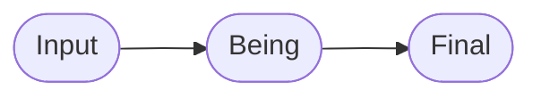
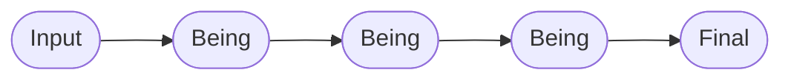
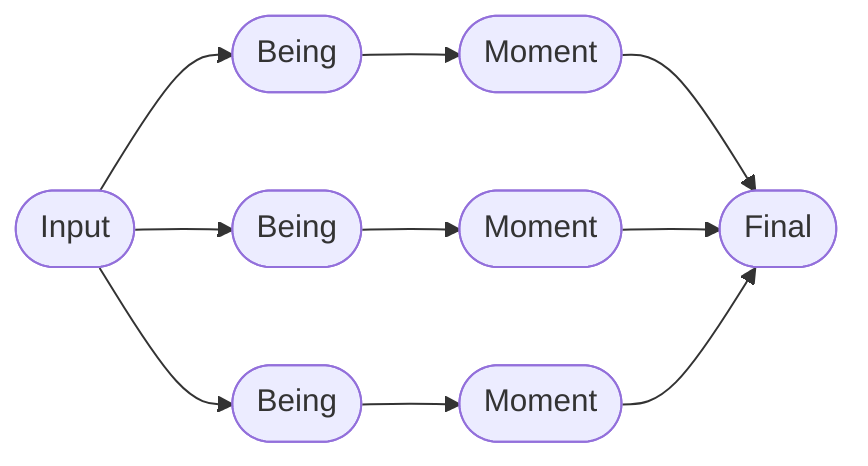
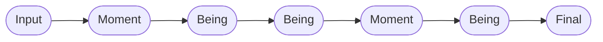
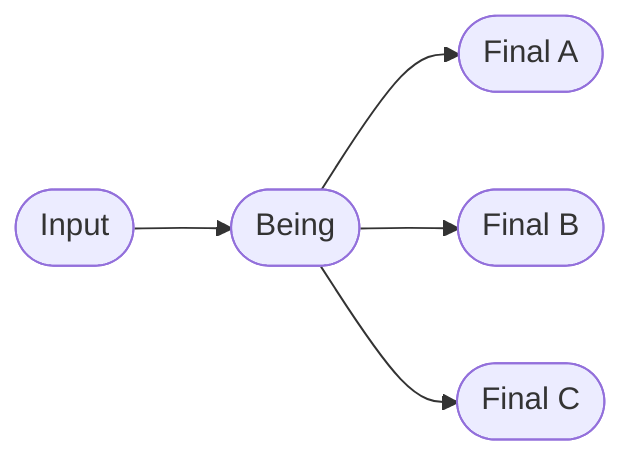
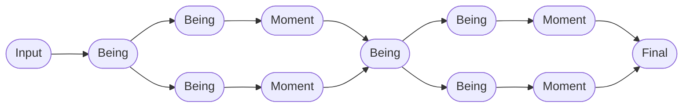
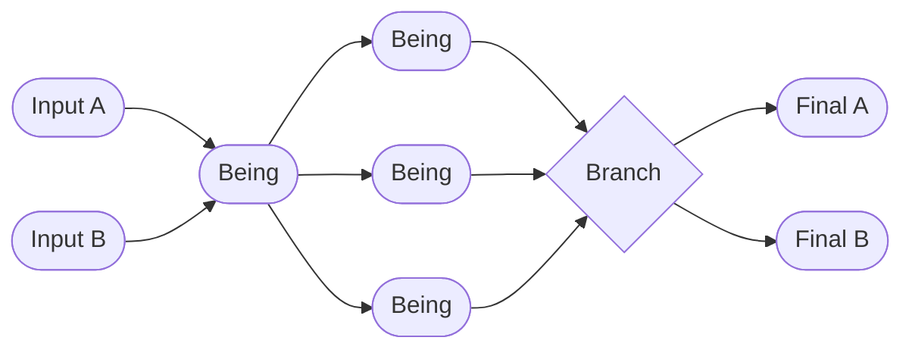

# Be Framework Patterns

A catalog of **metamorphosis patterns** for the [Be Framework](https://github.com/be-framework/be) — eight runnable PHP demos, each isolating one flow shape so you can copy it as a starting point for your own application.

> **"Be, Don't Do."** Every pattern models a workflow as a chain of typed, immutable *states that become the next state*, rather than methods that act on data.

---

## Choose a pattern

Pick the row that best describes your problem. Each link goes to a complete, tested implementation.

| If your problem looks like… | Pattern | Demo |
|---|---|---|
| One input, one output — no intermediate state | **Minimal** | [hello-world](./demos/hello-world/) |
| Validate and normalize a single form | **Linear** | [contact-form](./demos/contact-form/) |
| Several transformations that must run in order | **Sequential Chain** | [user-registration](./demos/user-registration/) |
| Independent concerns that run in parallel and merge | **Diamond** | [order-processing](./demos/order-processing/) |
| A sequential chain with staged intermediate commits | **Sequential + Moments** | [blog-publishing](./demos/blog-publishing/) |
| One input, several outcomes chosen by a decision | **Branching** | [medical-triage](./demos/medical-triage/) |
| Two pipelines in series, each with its own parallelism | **Cascade Diamond** | [loan-application](./demos/loan-application/) |
| Multiple inputs converge, fan out, then branch | **Complex Convergence** | [insurance-claim](./demos/insurance-claim/) |

> A machine-readable version of this catalog lives in [`docs/patterns.json`](./docs/patterns.json).

---

## Pattern catalog

### Minimal — [hello-world](./demos/hello-world/)

**Flow:** `Input → Final`


The simplest possible Be Framework demo. A greeting transformation with no Being or Moment layers.

> Concrete: `HelloInput → Hello`

### Linear — [contact-form](./demos/contact-form/)

**Flow:** `Input → Being → Final`



A contact form demonstrating basic input validation, email normalization, and receipt generation.

> Concrete: `ContactInput → EmailNormalized → ContactReceived`

### Sequential Chain — [user-registration](./demos/user-registration/)

**Flow:** `Input → Being(A) → Being(B) → Being(C) → Final`



User registration with chained Being transformations: email verification, password hashing, and profile enrichment.

> Concrete: `RegistrationInput → EmailVerified → PasswordHashed → ProfileEnriched → UserRegistered`

### Diamond — [order-processing](./demos/order-processing/)

**Flow:** `Input → [parallel Beings] → [parallel Moments] → Final`



E-commerce order processing with parallel Being chains (Inventory, Payment, Shipping) that produce Moments converging in the Final state.

> Concrete:
> ```text
> OrderInput ─┬→ StockLocated → QuantityChecked   → InventoryReserved ─┬→ OrderConfirmed
>             ├→ CardValidated → PaymentAuthorized → PaymentCompleted  ─┤
>             └→ AddressValidated → CarrierSelected → ShippingArranged ─┘
> ```

### Sequential + Moments — [blog-publishing](./demos/blog-publishing/)

**Flow:** `Input → Moment → Being → Being → Moment → Being → Final`



Article publishing staged through three Being classes (`ArticlePrepared`, `MarkdownRendered`, `SlugGenerated`) and two Moment classes (`ContentPrepared`, `MetadataResolved`), handling markdown rendering, slug generation, excerpt extraction, and author resolution.

> Concrete: `ArticleInput → ContentPrepared → ArticlePrepared → MarkdownRendered → MetadataResolved → SlugGenerated → ArticlePublished`

### Branching — [medical-triage](./demos/medical-triage/)

**Flow:** `Input → Being → [Branch] → Final(A) | Final(B) | Final(C)`



Emergency room triage implementing the JTAS protocol. One input branches to three possible Finals via a typed `$being` discriminator, with each branch's behavior carried by a Reason strategy class.

> Concrete:
> ```text
> PatientInput → TriageLevelDetermined
>                       │
>        ┌──────────────┼──────────────┐
>        ↓              ↓              ↓
>   [ImmediateCase] [UrgentCase] [NonUrgentCase]
>        ↓              ↓              ↓
> EmergencyAdmitted  UrgentQueued  OutpatientReferred
> ```

### Cascade Diamond — [loan-application](./demos/loan-application/)

**Flow:** `Input → Stage1(parallel → converge) → Stage2(parallel → Final)`



Mortgage application with staged Moment realization. Stage 1 Moments realize at eligibility confirmation; Stage 2 Moments realize at final approval.

> Concrete:
> ```text
> LoanInput → IdentityVerified ─┬→ CreditScored   → CreditApproved   ─┬→ EligibilityConfirmed
>                               └→ IncomeAssessed → IncomeApproved   ─┘
>                                                                      ↓
>                               ┌→ PropertyAppraised → CollateralValued ─┬→ LoanApproved
>                               └→ InsuranceQuoted   → InsurancePrepared ─┘
> ```

### Complex Convergence — [insurance-claim](./demos/insurance-claim/)

**Flow:** `Input(A) + Input(B) → converge → parallel(3) → Branch → Final(A) | Final(B)`



Insurance claim processing with multiple input convergence, three-way parallel assessment, and branching finals.

> Concrete:
> ```text
> ClaimInput ──┬→ ClaimRegistered ─┬→ ClaimValidated ─┬→ DamageAssessed  ─┬→ [threshold] → ClaimSettled
> PolicyInput ─┴→ PolicyVerified  ─┘                  ├→ AdjusterAssigned ─┤              or
>                                                     └→ FraudScreened   ─┘              ClaimEscalated
> ```

---

## Running tests

```bash
# Run a specific demo
cd demos/hello-world && composer install && vendor/bin/phpunit
```

Every demo ships with happy-path integration tests, Semantic validation unit tests, Reason layer logic tests, and (where applicable) Potential idempotency tests.

## Requirements

- PHP 8.2+
- [Ray.Di](https://ray-di.github.io/) (dependency injection)

## Background

Every pattern above is built from the same six-layer vocabulary. You do **not** need to understand the vocabulary to copy a pattern — but when you want to go deeper, start here:

- [`CLAUDE.md`](./CLAUDE.md) — invariants and reading order (also the AI assistant contract)
- [`docs/GLOSSARY.md`](./docs/GLOSSARY.md) — term-to-file reverse index
- [`demos/order-processing/docs/PHILOSOPHY.md`](./demos/order-processing/docs/PHILOSOPHY.md) — the conceptual rationale

| Layer | Greek / German | Role |
|---|---|---|
| **Input** | δύναμις (Dynamis) | Raw potential entering the system |
| **Being** | Dasein | Existential state with computed properties |
| **Moment** | 契機 (Keiki) | Transitional phase with deferred Potentials |
| **Final** | ἐνέργεια (Energeia) | Fully actualized result |
| **Semantic** | Sinn | Domain validation rules |
| **Reason** | Sufficient Reason | Business logic and external integrations |

## License

MIT

---

[日本語版はこちら](./README.ja.md)
